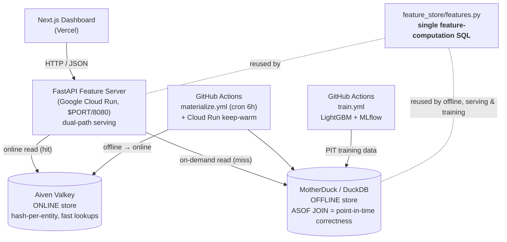

# ML System Design: End-to-End Feature Store

> **Recruiter TL;DR**
> - **What it is:** a full, live feature store — offline + online stores, point-in-time-correct training data, a dual-path serving API, and a monitoring dashboard — that structurally prevents *training-serving skew*, the #1 silent bug in production ML.
> - **Hardest problem solved:** guaranteeing the *same* feature values at training and serving time by computing every feature from **one** SQL definition reused across offline backfill, on-demand serving, and training's point-in-time joins (DuckDB `ASOF JOIN`) — so leakage-free training data and skew-free serving are impossible to drift apart by construction.
> - **Impact:** a production-shaped ML platform (PIT correctness, dual stores, scheduled materialization, KS-test drift monitoring, CI, 45 automated tests) deployed **end-to-end on entirely free tiers** — trained model reaches **ROC-AUC ≈ 0.98** on point-in-time-correct features, and a built-in leakage demo shows a naive join inflating AUC to ~1.0 before it collapses.

[](https://github.com/shiva-shivanibokka/ML-System-Design-Feature-Store/actions/workflows/ci.yml)


A feature store built to the architectural pattern of production systems like **Uber Michelangelo**, **Feast**, and **Tecton** — and it runs entirely on **free tiers**: no paid infra, no credit card required to fork and deploy your own copy.

**Live demo**
- Dashboard: https://ml-feature-store-shiv-a.vercel.app
- API: https://feature-store-api-548930096299.us-central1.run.app (`/docs` for the OpenAPI schema)

---

## Architecture



**Why it's shaped this way:** the single biggest correctness win is that feature computation lives in **exactly one place** — `feature_store/features.py`. Offline backfill, the on-demand serving fallback, and the training point-in-time join all call the same SQL, so there is no second implementation to drift out of sync. Two stores exist because they solve opposite problems: **MotherDuck (DuckDB)** is a columnar warehouse great at scanning history for backfills and ASOF joins but poor at single-entity point lookups; **Aiven Valkey** (Redis-compatible) is the reverse. Each store does the one job it's actually good at.

---

## What Makes This Different

1. **DuckDB `ASOF JOIN` for point-in-time correctness** — for each `(entity_id, label_timestamp)`, training joins the most recent feature snapshot with `event_time <= label_timestamp`. No future data leaks into a training row — the exact temporal join Feast/Tecton/Hopsworks are built around.
2. **Single-source feature computation (the anti-skew guarantee)** — one SQL `SELECT` computes all 13 features, reused by `compute_and_store()` (offline), `compute_on_demand()` (serving), and the training PIT join. Change a feature once; every consumer picks it up identically.
3. **Point-in-time leakage, demonstrated as a bug** — `training/train.py` first trains on a naive (leaky) join (AUC ≈ 1.0, then collapses under honest evaluation), then on the PIT-correct dataset (ROC-AUC ≈ 0.98). It answers the exact interview question: "what is training-serving skew, and how does a feature store prevent it?"
4. **Dual-path serving** — pre-materialized reads from Valkey, with a DuckDB on-demand fallback for cold-start entities; every request logs which path served it (visible on the dashboard's Materialization tab).
5. **Pandera schema validation** — every feature write is validated (types, null-ability, value ranges) before it lands, so bad upstream data fails loudly at the pipeline instead of silently at serving.
6. **KS-test skew detection** — `/skew-report` runs a per-feature Kolmogorov–Smirnov test comparing the training-time distribution against live serving, flagging drift at `p < 0.05`.
7. **Feature lineage graph** — provenance from raw tables → features → model, rendered as an interactive DAG.
8. **Infra-free CI** — every test runs against in-memory DuckDB and `fakeredis`; no live services required.

---

## Free-Tier Stack

| Component | Service | Free-tier limit |
|---|---|---|
| Offline store | **MotherDuck** (hosted DuckDB) | 10 GB storage / 10 compute-hours per month |
| Online store | **Aiven Valkey** (Redis-compatible) | 1 GB |
| Backend | **Google Cloud Run** | 2M requests / month, scale-to-zero |
| Frontend | **Vercel** (Hobby) | Unlimited personal projects |
| Experiment tracking | **MLflow** (local, DagsHub-ready) | Free — logs to `./mlruns` in this demo |
| Batch jobs / CI | **GitHub Actions** | 2,000 free minutes/month |

No Supabase, Fly.io, Render, or paid databases — every service above has a permanent free tier.

---

## Skills Demonstrated

- **Production ML deployment / MLOps** — model serving decoupled from training, on managed cloud infra
- **System design & architecture** — documented dual-store and single-source-of-computation trade-offs
- **Data engineering / ETL pipeline design** — raw events → validated features → offline + online stores
- **Cloud deployment (Google Cloud Run + Vercel + MotherDuck + Aiven)** — containerized, multi-service, all free-tier
- **RESTful API design** — FastAPI service with typed request/response models and OpenAPI docs
- **Point-in-time-correct feature engineering** — temporal (`ASOF`) joins to eliminate label leakage
- **Asynchronous / concurrent systems design** — async endpoints with thread-pool offload and a serialized shared DB connection
- **Containerization & Docker** — Cloud Run image honoring the injected `$PORT`
- **CI/CD pipeline implementation** — GitHub Actions for lint, tests, Docker build, scheduled materialization, and training
- **Test-driven development / automated testing** — 45 infra-free tests (in-memory DuckDB + `fakeredis`)
- **Observability & monitoring** — structured JSON logs, component-level `/health`, latency `/metrics`, KS-test drift detection
- **Database & schema design** — DuckDB schema with a composite primary key and idempotent writes
- **Frontend engineering** — Next.js (App Router) + TypeScript analytics dashboard

---

## Tech Stack

| Layer | Tool | Why |
|---|---|---|
| Offline store | **MotherDuck (DuckDB)** | Free-tier hosted analytical DB with native `ASOF JOIN` |
| Online store | **Aiven Valkey** | Redis-compatible, URL-configured, hash-per-entity |
| Backend | **FastAPI** on **Google Cloud Run** | Dual-path serving; container from the root `Dockerfile` |
| Frontend | **Next.js (App Router) + TypeScript** on **Vercel** | Dashboard: explorer, training pull, skew, materialization |
| Feature validation | **Pandera** | Schema enforcement at write time |
| Skew detection | **SciPy** KS test | Per-feature statistical comparison |
| Training | **LightGBM** + **MLflow** | PIT-correct training + experiment tracking |
| Batch jobs | **GitHub Actions** | Scheduled materialize, keep-warm, on-demand training |
| Observability | **structlog** JSON logs | Structured, searchable |

---

## Impact / Results

All figures below are reproducible from this repo — no invented benchmarks.

- **Model quality:** the LightGBM churn model reaches **ROC-AUC ≈ 0.98** on point-in-time-correct features (`python training/train.py`).
- **Leakage, made visible:** the deliberate naive-join demo inflates offline AUC to **~1.0**, then collapses under honest evaluation — a concrete illustration of the failure the whole system prevents.
- **Test suite:** **45 automated tests pass**, all against in-memory DuckDB + `fakeredis` (no live services), covering the single-source feature SQL, the ASOF PIT join, the dual-path serving endpoints, materialization status logic, and the skew detector.
- **Live, on free tiers:** frontend (Vercel), backend (Cloud Run), offline store (MotherDuck), and online store (Aiven Valkey) are all deployed and serving real data — the dashboard's Materialization tab shows live per-path serving-latency percentiles measured by the running service.

> This is a portfolio/demo system: the numbers above are correctness and reproducibility figures, not production-scale throughput benchmarks.

---

## Testing

```bash
pip install -r requirements.txt
pytest tests/ -q          # 45 tests, no external services needed
```

Tests are hermetic — they spin up an in-memory DuckDB and `fakeredis`, so they run identically on a laptop and in CI. `ci.yml` runs `ruff` (lint + format check), the full `pytest` suite with a coverage gate, and a Docker build of the backend image on every push.

---

## Local Dev Quickstart

Zero cloud accounts required — DuckDB falls back to a local file, Redis to `localhost`, MLflow to `./mlruns`.

```bash
# 1. Configure environment (all values default to local-only)
cp .env.example .env

# 2. Install dependencies
pip install -r requirements.txt

# 3. Seed synthetic data (users, transactions, support tickets)
python data/generate.py

# 4. Backfill 90 days of feature snapshots
python materialization/backfill.py --days 90

# 5. Materialize the latest snapshot into the online store
python materialization/materialize.py

# 6. Start the feature server
uvicorn serving.main:app --port 8080

# 7. In another shell, start the dashboard
cd frontend && npm install && npm run dev
```

Feature API docs: `http://localhost:8080/docs`. Dashboard: `http://localhost:3000`.

If you want a local Redis instead of pointing `REDIS_URL` at a hosted Valkey instance: `docker run -p 6379:6379 redis:7-alpine`.

---

## Deploy Your Own

### Backend — Google Cloud Run
```bash
gcloud run deploy feature-store-api \
  --source . \
  --region us-central1 \
  --allow-unauthenticated \
  --env-vars-file .env.yaml
```
`--source .` builds the root `Dockerfile` (Cloud Run backend image, listens on `$PORT`/8080) via Cloud Build and deploys it. `.env.yaml` (not committed) sets `MOTHERDUCK_TOKEN`, `REDIS_URL`, `DUCKDB_DATABASE`, and `ALLOWED_ORIGINS`.

### Seed the stores (one-time, required)
A fresh deploy has empty stores, so the API returns 404s / empty tables until you seed once. Point your local env at the cloud services (set `MOTHERDUCK_TOKEN`, `DUCKDB_DATABASE`, `REDIS_URL` in `.env`) and run:
```bash
python data/generate.py                       # raw tables → MotherDuck
python materialization/backfill.py --days 90   # feature_history snapshots
python materialization/materialize.py          # latest features → Aiven Valkey
```
Then the scheduled `materialize.yml` keeps the online store synced and Cloud Run warm. Run `train.yml` (or `python training/train.py`) once to populate the model registry and the training-time skew baseline.

### Frontend — Vercel
1. Import the repo into Vercel (GitHub-connected, auto-deploys on push).
2. Set **Root Directory = `frontend`**.
3. Add env var `NEXT_PUBLIC_API_URL = <your Cloud Run service URL>`.
4. After the first deploy, set the backend's `ALLOWED_ORIGINS` (Cloud Run env var) to your Vercel domain.

### Batch jobs — GitHub Actions
Add these repo secrets (Settings → Secrets and variables → Actions):
- `MOTHERDUCK_TOKEN`, `DUCKDB_DATABASE`, `REDIS_URL` — used by `materialize.yml` (every 6h) and `train.yml`
- `CLOUD_RUN_URL` — the Cloud Run service URL, for the keep-warm ping in `materialize.yml`
- `MLFLOW_TRACKING_URI`, `MLFLOW_TRACKING_USERNAME`, `MLFLOW_TRACKING_PASSWORD` — optional, for hosted MLflow (e.g. DagsHub); omit to log to `./mlruns`

---

## Project Structure

```
ML-System-Design-Feature-Store/
├── configs/
│   ├── schema.sql                # DuckDB schema (all tables; feature_history has a composite PK)
│   ├── features.yaml             # Feature definitions + lineage edges
│   └── config.yaml               # App config
├── data/generate.py             # Synthetic data → DuckDB raw tables
├── feature_store/
│   ├── connections.py            # DuckDB/MotherDuck + Redis client factories (locked single conn)
│   ├── features.py               # THE single source of feature computation
│   ├── schema.py                 # Idempotent schema apply
│   ├── registry.py               # Feature definitions sync (YAML → DuckDB)
│   ├── offline_store.py          # DuckDB: compute, ASOF PIT join, stats
│   ├── online_store.py           # Redis/Valkey: batch read/write + entity index
│   └── validator.py              # Pandera schema validation
├── materialization/
│   ├── backfill.py               # Historical feature computation
│   └── materialize.py            # Offline → online sync
├── training/train.py            # PIT leakage demo + LightGBM + MLflow
├── serving/main.py              # FastAPI dual-path feature server
├── skew/detector.py             # KS test per feature, snapshot capture
├── lineage/graph.py             # Lineage DAG queries
├── frontend/                     # Next.js dashboard (deploys to Vercel)
├── tests/                        # 45 infra-free tests: in-memory DuckDB + fakeredis
├── .github/workflows/            # ci.yml, materialize.yml (cron), train.yml
├── Dockerfile                    # Cloud Run backend image ($PORT/8080)
├── AUDIT.md · PLAN.md            # Bug-audit report + fix plan (from a full-repo audit)
├── requirements.api.txt          # Backend runtime deps
└── requirements.txt              # Full dev deps (API + training + tooling)
```

---

## Known Trade-offs & Roadmap

Deliberately out of scope for a free-tier portfolio/demo system, and honest about it:
- **No auth** — endpoints are public read-only; the point is the feature-store architecture, not an auth layer. `ALLOWED_ORIGINS` is env-configurable to lock CORS to the frontend domain.
- **Single uvicorn worker** — intentional (see the `Dockerfile` comment): the stack is sized for free-tier compute-hours, and one shared DuckDB/MotherDuck connection avoids burning the offline store's monthly quota. Blocking DB/Redis calls are offloaded off the event loop so one slow query can't stall the rest.
- **Ephemeral container** — all durable state lives in MotherDuck / Aiven Valkey; nothing persists on the Cloud Run filesystem.
- **Roadmap:** hosted MLflow (DagsHub) for a persistent model registry; auth + rate limiting before any non-demo exposure; migrating `datetime.utcnow()` to timezone-aware datetimes.

A full self-audit of this codebase (correctness, security, concurrency, performance, tests) lives in [`AUDIT.md`](AUDIT.md), with the corresponding fix plan in [`PLAN.md`](PLAN.md).

---

## License

[MIT](LICENSE) © 2026 Shivani Bokka.
